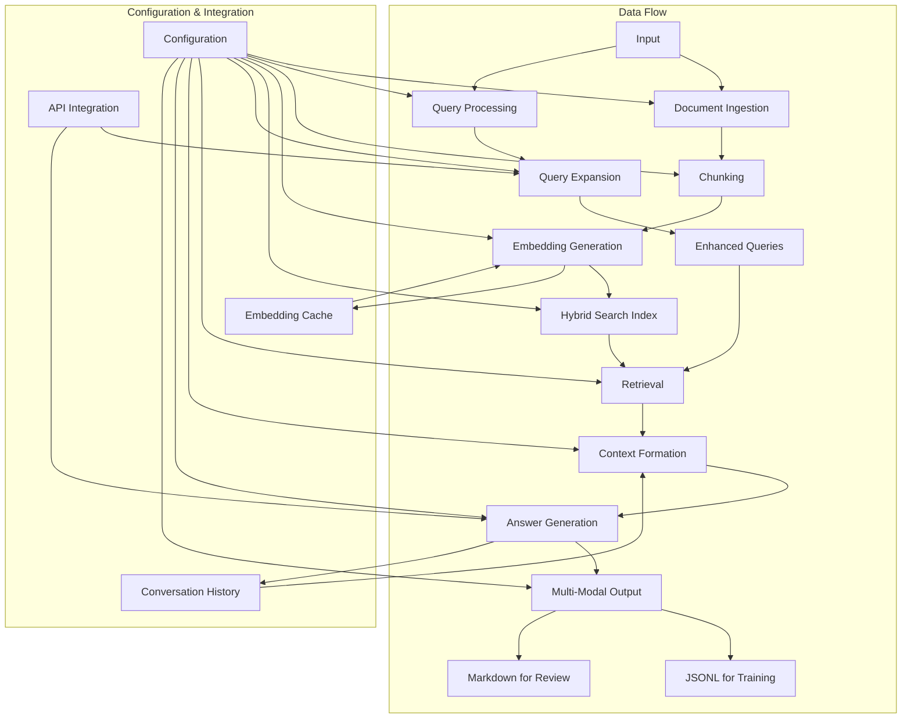

---

groundedICARUS streamlines the creation of document-grounded datasets by processing markdown files, expanding queries, and generating synthetic QA pairs and conversations, offering flexible configuration and output options for enhanced lazy rag dataset generation.


**note:** please excuse some very obvious frustrated workarounds, this was j meant to be an afternoons quick script. search will need tuning unless you are just golden running 🤙, but is close enough, numbers in relevence scores are vibes valued. chunking method needs a refactor it has some double handling, same with bm25 indexing being within the loop rather than at the end etc. 👽

```
Question: i am trying to pursue a life on novelty to "entertain" god, how well does this align with walter russels perspective?

Answer: 
<scratchpad>
Based on the provided document excerpts, we can analyze the perspective of Walter Russell and its alignment with the pursuit of a life of novelty to "entertain" God.

From the excerpts, it is evident that Walter Russell's philosophy emphasizes the importance of understanding and aligning with the universe's natural laws and principles. He mentions the need to "rise above" one's sensing and to "be the whole universe in your KNOWING" (Doc [0]). This suggests that Russell values a deep understanding and connection with the universe, rather than mere entertainment or novelty.

Moreover, Russell's emphasis on the interconnectedness of all units of creation (Doc [2]) and the importance of recognizing the "ONENESS" and "INTERDEPENDENCE" of every unit (Doc [2]) suggests that he would prioritize a holistic and integrated approach to life, rather than a focus on superficial novelty.

In addition, Russell's discussion of the need to transform our "primitive world thinking" and to understand the universe as a "sexed electric universe" (Doc [4]) implies that he values a profound and fundamental understanding of the universe, rather than a superficial pursuit of novelty.

Therefore, based on Walter Russell's perspective, pursuing a life of novelty to "entertain" God may not be fully aligned with his philosophy. Instead, Russell's ideas suggest a more profound and holistic approach to life, one that emphasizes understanding, connection, and alignment with the universe's natural laws and principles.

Relevant modality frameworks:
- **Necessity:** Understanding and aligning with the universe's natural laws and principles is necessary for a profound and holistic approach to life.
- **Possibility:** Pursuing a life of novelty to "entertain" God is possible, but it may not be fully aligned with Walter Russell's philosophy.
- **Obligation:** Recognizing the interconnectedness of all units of creation and the importance of understanding the universe's natural laws and principles is obligatory for a deep and meaningful connection with the universe.
</scratchpad>

<relevance>
[
  {"chunk_0": {"score": 0.8, "rationale": "Alignment with Russell's emphasis on understanding and connection with the universe"}},
  {"chunk_1": {"score": 0.7, "rationale": "Contrast with Russell's emphasis on profundity and holism"}},
  {"chunk_2": {"score": 0.6, "rationale": "Relevance to Russell's discussion of the universe as a 'sexed electric universe'"}},
  ...
]
</relevance>

<citations>
<ref id="0">UNIVERSAL LAW, NATURAL SCIENCE AND PHILOSOPHY by Walter Russell, Sc, D., and Lao Russell</ref>
<ref id="1">Home Study Course Unit 10 Lessons 37,38,39,40 by Walter Russell</ref>
<ref id="2">Home Study Course Unit 3 Lessons 9,10,11,12 by Walter Russell</ref>
</citations>

<answer>
Pursuing a life of novelty to "entertain" God may not be fully aligned with Walter Russell's philosophy, which emphasizes understanding, connection, and alignment with the universe's natural laws and principles. Instead, Russell's ideas suggest a more profound and holistic approach to life. <ref id="0">UNIVERSAL LAW, NATURAL SCIENCE AND PHILOSOPHY by Walter Russell, Sc, D., and Lao Russell</ref>

Additional Context:
Walter Russell's philosophy emphasizes the importance of recognizing the interconnectedness of all units of creation and the need to understand the universe's natural laws and principles. This approach is in contrast to a superficial pursuit of novelty, which may not be fully aligned with Russell's ideas. <ref id="1">Home Study Course Unit 10 Lessons 37,38,39,40 by Walter Russell</ref>
</answer>
```

Document Ingestion and Indexing:
1. The script can process either a single markdown document or a folder containing multiple markdown files.
2. Each document is split into chunks, and embeddings are generated for these chunks.
3. A hybrid search index is created, combining embedding-based similarity and BM25 text matching.

Query Processing:
1. Queries can be input interactively or loaded from a text file.
2. For dataset generation, a text file with queries separated by double newlines (nlnl) can be used.

Command-line Usage:

1. Basic usage with a single document:
   ```
   python script_name.py --input path/to/document.md
   ```

2. Processing a folder of markdown files:
   ```
   python script_name.py --input path/to/markdown/folder
   ```

3. Using a configuration file:
   ```
   python script_name.py --config path/to/config.json --input path/to/documents
   ```

4. Processing queries from a file:
   ```
   python script_name.py --input path/to/documents --query-file path/to/queries.txt
   ```

Query File Example (queries.txt):
```
What is the main topic of the document?

How does the author describe the problem?

What solutions are proposed in the text?

Can you summarize the key findings?

What evidence is presented to support the main argument?
```

Each query in this file is separated by a double newline (nlnl).

The script will process these queries sequentially, generating answers based on the ingested documents. This is particularly useful for creating large datasets of question-answer pairs grounded in specific documents.

Output:
1. The script generates JSONL files containing the query expansions and responses.
2. A markdown file is also created with a detailed log of the conversation, including system prompts, user queries, and AI responses.

This approach allows for efficient generation of document-grounded QA datasets, which can be valuable for fine-tuning language models or evaluating their performance on specific domains or document sets.


---

## FLOW

1. Hybrid Search:
   - Combines embedding similarity and BM25 for improved relevance

2. Dynamic Query Expansion:
   - Uses LLMs to generate context-aware, enhanced queries

3. Adaptive Chunking:
   - Creates variable-sized chunks based on content semantics

4. Multi-Modal Conversation Export:
   - Generates both JSONL for model training and Markdown for human review

5. Flexible API Integration:
   - Supports multiple LLM providers (OpenAI, Groq, Anthropic) and local models

6. Configurable Conversation Modes:
   - Switchable between zero-shot and multi-turn conversation logging

7. On-the-fly Embedding Generation:
   - Creates and caches embeddings for efficient reuse




# Configuration Options

```config.json
{
  "model_name": "orca-mini-3b-gguf2-q4_0.gguf",
  "embedding_resolution": 64,
  "chunk_size": 256,
  "chunk_overlap": 16,
  "history_window": 3,
  "system_prompt_file": "",
  "query_expansion_system_prompt_file": "",
  "query_expansion_prompt_file": "",
  "max_doc_length": 256,
  "top_k": 10,
  "relevance_threshold": 0.5,
  "include_full_content": false,
  "truncate_start": true,
  "query_expansion_output": "query_expansion.jsonl",
  "response_output": "response.jsonl",
  "api_type": "openai",
  "api_base_url": "http://localhost:11434/v1",
  "api_key": "ollama",
  "query_expansion_model": "llama3.1:latest",
  "answer_generation_model": "llama3.1:latest",
  "use_conversation_history": false,
  "include_position": false,
  "max_documents_in_prompt": 3,
  "zero_shot": true,
}
```

## Model Settings

- `model_name`: The name of the local model to use (e.g., "orca-mini-3b-gguf2-q4_0.gguf"). This is used for the GPT4All model.
- `query_expansion_model`: The model to use for query expansion. Choose based on your API and available models.
- `answer_generation_model`: The model to use for answer generation. Choose based on your API and available models.

## API Settings

- `api_type`: The type of API to use. Options: 'openai', 'anthropic', 'groq', or 'ollama'.
- `api_base_url`: The base URL for the API. For local Ollama, use 'http://localhost:11434/v1'. For OpenAI, use 'https://api.openai.com/v1'.
- `api_key`: The API key. Use 'ollama' for local Ollama, or your actual API key for other services.

## Embedding Settings

- `embedding_resolution`: The dimensionality of the embedding vectors. Higher values may provide more accurate but slower embeddings. (Default: 64)

## Chunking Settings

- `chunk_size`: The size of text chunks for processing. Larger chunks provide more context but may be slower to process. (Default: 256)
- `chunk_overlap`: The number of tokens to overlap between chunks. Higher overlap may improve coherence but increases processing time. (Default: 16)

## Conversation Settings

- `history_window`: The number of previous conversation turns to include for context. Larger windows provide more context but may slow down processing. (Default: 3)
- `use_conversation_history`: Whether to use conversation history for context in responses. (Options: true/false)
- `zero_shot`: Whether it saves as a 0-shot q&a pair to jsonl or as a single multi-turn conversation. (Options: true/false)

## Document Settings

- `max_doc_length`: The maximum length of document content to include in prompts. Longer lengths provide more context but may exceed token limits. (Default: 256)
- `include_full_content`: Whether to include the full document content in prompts. Enabling may provide more context but significantly increases token usage. (Options: true/false)
- `truncate_start`: Whether to truncate content from the start (true) or end (false) when reducing to max_doc_length. (Options: true/false)
- `max_documents_in_prompt`: The maximum number of documents to include in the prompt. More documents provide broader context but increase token usage. (Default: 3)

## Retrieval Settings

- `top_k`: The number of top-ranked chunks to retrieve. Higher values may improve recall but increase processing time and token usage. (Default: 10)
- `relevance_threshold`: The minimum relevance score for a chunk to be included. Higher values increase precision but may reduce recall. (Default: 0.5)

## Output Settings

- `include_position`: Whether to include position information (start/end) in the output for each chunk. (Options: true/false)
- `query_expansion_output`: The filename for saving query expansion data. (Default: "query_expansion.jsonl")
- `response_output`: The filename for saving response data. (Default: "response.jsonl")

## Prompt Settings

- `system_prompt_file`: Path to the file containing the system prompt. If empty, a default prompt will be used.
- `query_expansion_system_prompt_file`: Path to the file containing the system prompt for query expansion. If empty, a default prompt will be used.
- `query_expansion_prompt_file`: Path to the file containing the query expansion prompt. If empty, a default prompt will be used.

To use groundedICARUS, prepare three separate markdown (.md) files for its key prompts:

1. Query Expansion System Prompt: A general instruction for expanding queries.
2. Query Expansion Prompt: Include placeholders {source} and {documents} for context. This guides the query enhancement process.
3. Q&A System Prompt: Directs the final answer generation step.

note: JSONL excludes search enhanced query and saves it seperately, without distorting the initial user query. 

  ```
  {
  "id": 0,
  "conversations": [
    {
      "from": "system",
      "value": "System prompt content"
    },
    {
      "from": "human",
      "value": "User query with formatted retrival docs"
    },
    {
      "from": "gpt",
      "value": "AI-generated answer",
      "weight": 1
    }
  ],
  "docs": [
    {
      "content": "Relevant chunk of text from the document",
      "source": "filename.md",
      "start": 0,
      "end": 500,
      "relevance": 0.95
    }
  ]
}
```


